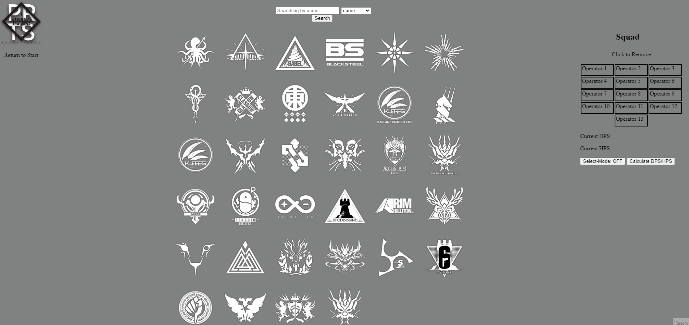

# Arknights Operator Database

Arknights Operator Database is both a operator search system and a Damage Per Second(DPS)/Healing Per Second(HPS) calculator.

## Usage

Clicking PRTS returns you to the start.

# Searching Operators

Click a faction to receive a list of all operators within the faction. 
Or use the searchbar to find operators by various catagories. When searching by name, you are taken directly to the operator's profile.
Another way to go to their profile is to click their name in the search lists. 

# Damage Per Second / Healing Per Second Calculator

After toggling on select-mode, clicking an operator's name in their profile or in any search list will add them to your squad. You can then
click 'Calculate DPS/HPS' to receive the total damage and healing values of your team. Clicking an operator within your squad removes them.

# Editing Operators

Click 'edit' within an operator profile to edit them. The form will prefill the current data, and after a successful edit, re-renders the profile.

# Usage Gif

## Contributing

Pull requests are welcome. Please be sure to email or open an issue related to the changes you would like to make.

## Project Status

In-Progress.

## Contact

If you are having trouble, would like to make a request or query, contact thepuddingdeity@gmail.com with the email subject as:
Arknights DB (help/query/request)

## Sources

Faction and Class images - https://arknights.fandom.com/wiki/Arknights_Wiki

Basic Operator Information (Such at attack values, birthplace...) and Chiave Gang faction image - https://gamepress.gg/arknights/

## Legal Stuff

Each image is a concept art of Arknights. Though these images are subject to copyright, it is believed that their use qualifies as fair use under U.S. fair use laws.

Arknights is copyright of Hypergryph Network Technology Co., Ltd.

## License

[MIT](https://choosealicense.com/licenses/mit/)